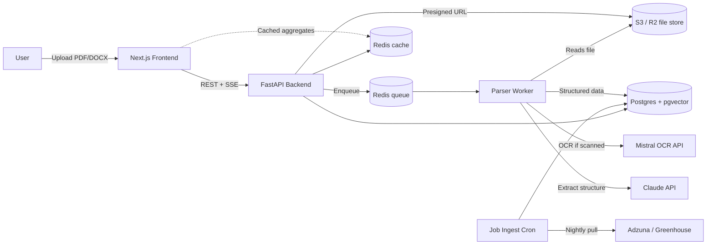
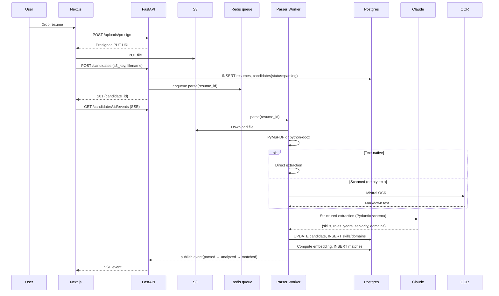

# Isobar — Backend & Platform Architecture

> Module 2 of 2, split from `ISOBAR-ARCHITECTURE.md`. Covers system architecture, the FastAPI backend, data model, ingestion pipeline, matching/heatmap, infrastructure, security, and roadmap. Product overview, UX/design system, and the Next.js frontend live in [ARCHITECTURE-FRONTEND.md](./ARCHITECTURE-FRONTEND.md).

---

## Contents

1. [System architecture](#1-system-architecture)
2. [Backend](#2-backend)
3. [Data model](#3-data-model)
4. [Résumé ingestion pipeline](#4-résumé-ingestion-pipeline)
5. [Job matching & heatmap](#5-job-matching--heatmap)
6. [Infrastructure & deployment](#6-infrastructure--deployment)
7. [Security, privacy, compliance](#7-security-privacy-compliance)
8. [MVP scope & roadmap](#8-mvp-scope--roadmap)

---

## 1. System architecture

A deliberately small set of moving parts. Nothing exotic; every choice can be swapped later without touching the app.



### The four services

| Service | Responsibility | Runs as |
|---|---|---|
| **Web (Next.js)** | UI, auth session, calls API, renders map + charts. | Vercel |
| **API (FastAPI)** | Auth, upload URLs, read endpoints, orchestration. | Cloud Run / Fly.io |
| **Parser worker** | Consumes queue, parses résumés, writes to DB. | Cloud Run / Fly.io |
| **Job ingest cron** | Nightly pull of open jobs, geocoding, aggregate refresh. | Scheduled Cloud Run job |

Postgres + Redis + S3 are the only stateful stores. That's it.

---

## 2. Backend

**Stack** — again, minimum viable.

| Concern | Choice |
|---|---|
| API framework | **FastAPI** (async, Pydantic validation, free OpenAPI) |
| ASGI server | **Uvicorn** behind a load balancer |
| Queue | **Arq** on Redis (simpler than Celery, sufficient for our load) |
| ORM | **SQLAlchemy 2.x** (async) + **Alembic** for migrations |
| Database | **PostgreSQL 16** + **pgvector** extension |
| Cache | **Redis 7** (same instance as queue) |
| Object storage | **AWS S3** or **Cloudflare R2** |
| Auth verification | JWT from Clerk, verified via public JWKS |
| LLM | **Claude Sonnet 4.6** via Anthropic API |
| OCR | **Mistral OCR API** (scanned PDFs only) |
| Text-native PDF parse | **PyMuPDF** (fitz) |
| DOCX parse | **python-docx** |

### API surface

Kept intentionally small.

| Method | Path | Purpose |
|---|---|---|
| `POST` | `/uploads/presign` | Return presigned S3 PUT URL. |
| `POST` | `/candidates` | Create candidate record from uploaded file key; enqueues parse. |
| `GET`  | `/candidates/:id` | Basic candidate record + status. |
| `GET`  | `/candidates/:id/snapshot` | Everything needed by the dashboard (summary, expertise, hotspots, first opportunities page). |
| `GET`  | `/candidates/:id/opportunities?cursor=…` | Paginated opportunities. |
| `GET`  | `/candidates/:id/events` | Server-Sent Events stream of parse progress. |
| `POST` | `/candidates/:id/rescore` | Re-run matching (admin / after job index refresh). |
| `DELETE` | `/candidates/:id` | Hard-delete candidate + file (GDPR). |

Everything is scoped by the caller's Clerk `org_id` (org-level tenancy).

### Layout

```
backend/
├── app/
│   ├── main.py                     # FastAPI app + routers
│   ├── config.py                   # settings via pydantic-settings
│   ├── deps.py                     # DB, Redis, S3, current-user injectors
│   ├── auth.py                     # Clerk JWT verification
│   ├── routers/
│   │   ├── uploads.py
│   │   ├── candidates.py
│   │   └── health.py
│   ├── models/                     # SQLAlchemy models
│   ├── schemas/                    # Pydantic schemas (request/response)
│   ├── services/
│   │   ├── parsing.py              # picks PyMuPDF / docx / OCR path
│   │   ├── extraction.py           # Claude structured output via instructor
│   │   ├── matching.py             # pgvector search + boolean filters
│   │   └── scoring.py              # signal score
│   └── workers/
│       ├── parse_worker.py         # Arq worker
│       └── job_ingest.py           # nightly cron
├── alembic/                        # migrations
└── tests/
```

---

## 3. Data model

Enough to run the product, not a byte more.

```sql
-- Tenancy
CREATE TABLE orgs (
  id            uuid PRIMARY KEY,
  clerk_org_id  text UNIQUE NOT NULL,
  name          text NOT NULL,
  created_at    timestamptz DEFAULT now()
);

CREATE TABLE users (
  id            uuid PRIMARY KEY,
  clerk_user_id text UNIQUE NOT NULL,
  org_id        uuid REFERENCES orgs(id),
  email         text NOT NULL,
  created_at    timestamptz DEFAULT now()
);

-- Résumés & candidates
CREATE TABLE resumes (
  id            uuid PRIMARY KEY,
  org_id        uuid REFERENCES orgs(id),
  uploaded_by   uuid REFERENCES users(id),
  s3_key        text NOT NULL,
  filename      text NOT NULL,
  mime_type     text NOT NULL,
  bytes         int  NOT NULL,
  status        text NOT NULL,      -- uploaded | parsing | parsed | failed
  created_at    timestamptz DEFAULT now()
);

CREATE TABLE candidates (
  id            uuid PRIMARY KEY,
  resume_id     uuid REFERENCES resumes(id),
  org_id        uuid REFERENCES orgs(id),
  name          text,
  current_title text,
  years_exp     int,
  seniority     text,               -- junior|mid|senior|staff|principal
  signal_score  int,
  embedding     vector(1024),       -- for role-matching
  created_at    timestamptz DEFAULT now()
);

CREATE TABLE candidate_skills (
  candidate_id  uuid REFERENCES candidates(id),
  skill         text,
  weight        real,               -- 0..1
  PRIMARY KEY (candidate_id, skill)
);

CREATE TABLE candidate_domains (
  candidate_id  uuid REFERENCES candidates(id),
  domain        text,               -- cloud | ml | backend | data | devops | product…
  weight        real,               -- 0..1, sums to ~1
  PRIMARY KEY (candidate_id, domain)
);

-- Jobs (populated by ingest cron)
CREATE TABLE jobs (
  id            uuid PRIMARY KEY,
  source        text NOT NULL,      -- adzuna | greenhouse | lever | ...
  source_id     text NOT NULL,
  title         text NOT NULL,
  company       text,
  city          text,
  country_code  text,
  lat           numeric(9,6),
  lon           numeric(9,6),
  seniority     text,
  comp_min      int,
  comp_max      int,
  currency      char(3),
  description   text,
  embedding     vector(1024),
  posted_at     timestamptz,
  fetched_at    timestamptz DEFAULT now(),
  UNIQUE (source, source_id)
);

CREATE INDEX jobs_city_idx        ON jobs (city, country_code);
CREATE INDEX jobs_embedding_idx   ON jobs USING hnsw (embedding vector_cosine_ops);

-- Precomputed matches (refreshed on candidate parse or job ingest)
CREATE TABLE matches (
  candidate_id  uuid REFERENCES candidates(id),
  job_id        uuid REFERENCES jobs(id),
  score         real,               -- 0..1 cosine + filter boost
  PRIMARY KEY (candidate_id, job_id)
);

-- Nightly-aggregated heatmap cells (per candidate role family)
CREATE TABLE demand_aggregates (
  role_family   text NOT NULL,
  city          text NOT NULL,
  country_code  text NOT NULL,
  lat           numeric(9,6),
  lon           numeric(9,6),
  demand_score  int NOT NULL,       -- 0..100
  open_roles    int NOT NULL,
  computed_at   timestamptz DEFAULT now(),
  PRIMARY KEY (role_family, city, country_code)
);
```

Everything ties to `org_id` at the row level; row-level security policies enforce tenancy so no service code can accidentally cross an org boundary.

---

## 4. Résumé ingestion pipeline

Kept as three stages: **parse → extract → match**. Each writes to Postgres and emits an event over Redis pub/sub for the SSE stream.



### Stage 1 — Parse

Route by file type:

- **`application/pdf`** → PyMuPDF `page.get_text()` per page. If the total extracted text is `< 100 chars/page`, treat as scanned and fall through to OCR.
- **`application/vnd.openxmlformats-officedocument.wordprocessingml.document`** (DOCX) → `python-docx`.
- **Scanned PDF / image** → **Mistral OCR API** returns clean markdown that preserves headings and lists.

Output at this stage is one big markdown/plaintext blob per résumé.

### Stage 2 — Extract

The blob goes to Claude with a fixed Pydantic schema (using the `instructor` library):

```python
class Extraction(BaseModel):
    name: str | None
    current_title: str | None
    years_experience: int | None
    seniority: Literal["junior","mid","senior","staff","principal"] | None
    skills: list[Skill]                # {name, weight 0..1}
    domains: list[Domain]              # {name, weight; sums ~= 1.0}
    roles: list[Role]                  # {company, title, from, to}
```

We also embed the concatenated `roles + skills + domains` string with `bge-large-en-v1.5` (via `sentence-transformers` in-process, or via a hosted endpoint — either is fine at MVP scale) and store the vector on `candidates.embedding`.

### Stage 3 — Match

Given the candidate embedding, find top-K similar jobs. Two-step:

1. **ANN search** via pgvector HNSW index: top 500 by cosine similarity.
2. **Boolean rerank / filter**: seniority within ±1 tier, comp band overlaps candidate's likely band, city has ≥ 1 open role at this seniority.

Insert rows into `matches` with the final score. That table drives the opportunities list on the dashboard.

---

## 5. Job matching & heatmap

### Job ingestion (nightly cron)

- Pull from **Adzuna** (aggregator, cheap, covers most markets) and any B2B integrations (**Greenhouse**, **Lever**, **Ashby** for enterprise customers).
- Geocode `{city, country}` → `lat/lon` in batch via **Nominatim** (self-hosted for volume) or **Mapbox Geocoding**. Cache by city name so we don't re-geocode.
- Embed each job description with the same model as candidates.
- Upsert into `jobs`.

### Heatmap aggregation

Also nightly, after job ingest:

```sql
-- Simplified aggregation
INSERT INTO demand_aggregates (role_family, city, country_code, lat, lon, demand_score, open_roles)
SELECT
  role_family,
  city, country_code, avg(lat), avg(lon),
  LEAST(100, round(100 * ln(count(*) + 1) / ln(1000)))  AS demand_score,
  count(*) AS open_roles
FROM jobs
WHERE posted_at > now() - interval '30 days'
GROUP BY role_family, city, country_code
ON CONFLICT (role_family, city, country_code) DO UPDATE
SET demand_score = EXCLUDED.demand_score,
    open_roles   = EXCLUDED.open_roles,
    computed_at  = now();
```

Log-scale so a city with 500 openings doesn't wash out a city with 50. When a candidate loads the dashboard, the API just joins `candidates.role_family` against `demand_aggregates` and returns the top ~30 hotspots. This keeps the map render fast (no per-request heavy computation).

### Signal score

Simple, transparent formula:

```
signal_score = round(
    0.55 * top_match_score        // best cosine similarity to any live job
  + 0.25 * market_depth_norm      // log(open_roles across matched hotspots) / log(1000)
  + 0.10 * recency_bonus          // how fresh the résumé's most recent role is
  + 0.10 * skill_breadth          // shannon entropy across domain weights
) * 100
```

Every input is stored, so we can display "why this score" when the user asks.

---

## 6. Infrastructure & deployment

Small, boring, cheap to run at MVP scale. All of it is a single-region setup initially; add EU replica when a paying EU customer asks.

| Layer | Choice | Why |
|---|---|---|
| Frontend hosting | **Vercel** | Fits Next.js perfectly, previews per PR. |
| API + worker | **Google Cloud Run** or **Fly.io** | Container-based, autoscale to zero for the worker. |
| Cron | Cloud Run **Jobs** with **Cloud Scheduler** | One less service. |
| Postgres | **Neon** or **Supabase** | pgvector supported out of the box; branchable for previews. |
| Redis | **Upstash** | Serverless, per-request pricing at small scale. |
| Object storage | **Cloudflare R2** | S3-compatible, no egress fees, cheap. |
| DNS + edge | **Cloudflare** | Front the API through it too. |
| Secrets | GitHub Actions → deploy target's secret manager | Nothing exotic. |
| Observability | **OpenTelemetry** → **Grafana Cloud** (or Datadog) for traces/logs; **Sentry** for FE errors. |
| CI | **GitHub Actions** | Lint, typecheck, tests, deploy. |

### Environments

- `preview` — per PR (Vercel + Neon branch + ephemeral Cloud Run revision).
- `staging` — always-on integration environment.
- `prod` — main.

### Rough monthly cost at MVP

| Item | Estimate |
|---|---|
| Vercel (Pro) | $20 |
| Cloud Run (API + worker) | $30–$80 |
| Neon (production DB) | $25–$70 |
| Upstash Redis | $10 |
| R2 storage | $5 |
| Anthropic API (Claude Sonnet) | usage-based, ~$0.03 per résumé |
| Mistral OCR | ~$0.001 per page, only ~30% of résumés |
| Adzuna | free tier fits early volume |
| **Total infra** | **~$100–$200/mo** before LLM/OCR |

---

## 7. Security, privacy, compliance

Résumés are PII. Treat them accordingly.

- **Encryption at rest** — Neon and R2 encrypt by default; enable customer-managed keys when an enterprise customer requires it.
- **Encryption in transit** — TLS everywhere. No plaintext ingress.
- **Access control** — Clerk JWT on every API call, org-scoped queries enforced by Postgres row-level security policies (defense in depth vs. app-level bugs).
- **Signed URLs only** for résumé downloads. Presigned URLs expire in 5 minutes.
- **Retention** — auto-delete résumés after 90 days by default (configurable per org).
- **Right to erasure** — `DELETE /candidates/:id` deletes the row, the S3 object, and cascades to skills, domains, and matches within the same transaction.
- **Audit log** — every candidate read/write is written to an append-only `audit_events` table.
- **PII handling for LLM calls** — Claude API calls are made with Anthropic's zero-retention header. Mistral OCR is called with equivalent settings when their API supports it; otherwise we redact obvious PII (email, phone) before sending, and rehydrate locally.
- **Data residency** — EU customers get an EU Cloud Run + Neon EU region; requests are routed via Cloudflare based on org configuration.
- **GDPR / SOC 2** — reachable within 6 months of first enterprise customer; the shape above (row-level tenancy, audit log, retention, erasure) is designed to make that trivial.

---

## 8. MVP scope & roadmap

### v0.1 — internal demo (2 weeks)

- Upload text-native PDFs only, single-tenant.
- PyMuPDF + Claude extraction.
- Adzuna as sole job source.
- Postgres + pgvector, no Redis yet — synchronous parse in the request.
- Dashboard renders live; heatmap uses a small hard-coded city list to sanity-check the UI.

### v0.5 — first customer (6 weeks)

- Add Clerk auth, orgs, RLS.
- Add Redis + Arq worker; parsing becomes async with SSE progress.
- DOCX support; scanned-PDF path via Mistral OCR.
- Nightly `demand_aggregates` job.
- Cost & rate-limit guardrails on LLM calls.

### v1.0 — enterprise-ready

- SSO/SAML via Clerk enterprise.
- SOC 2 Type I ready; audit log surfaced in a settings page.
- Per-org retention policy.
- Second job source (Greenhouse public boards or a customer-supplied ATS feed).
- EU data residency toggle.

### Deferred

- Vector database swap (Pinecone / Weaviate) — only when pgvector's HNSW slows down past a few million jobs.
- Fine-tuned extraction model to cut LLM cost once we have labeled résumé volume.
- Public API for programmatic access.
